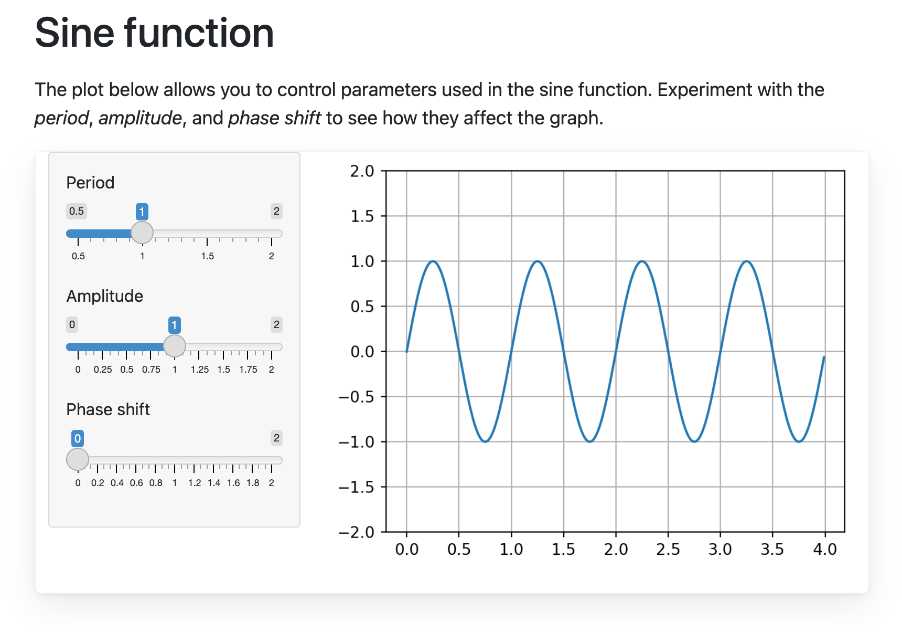
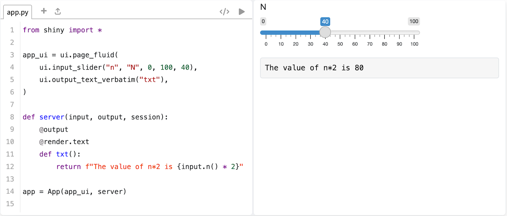
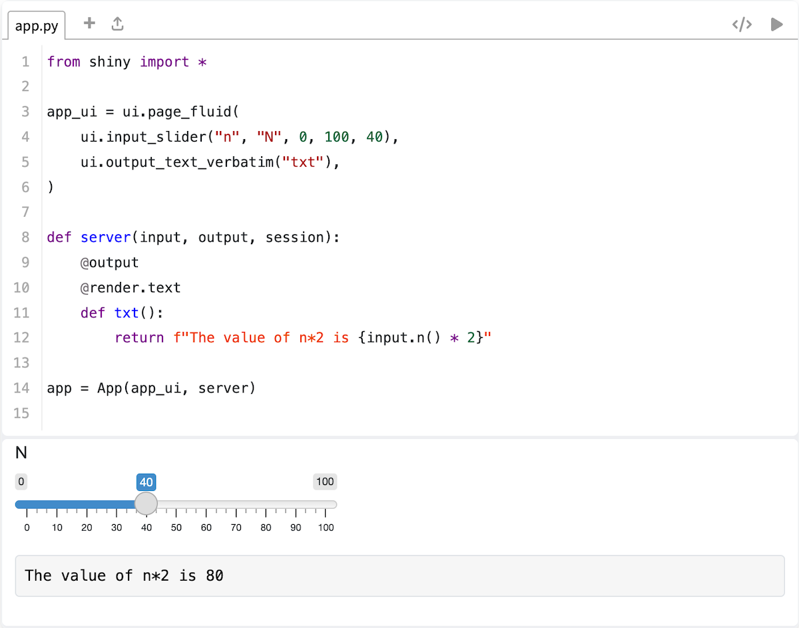

Shinylive Quarto extension
==========================

This extension lets you embed [Shinylive](https://shiny.rstudio.com/py/docs/shinylive.html) applications in a Quarto document. These are [Shiny for Python](https://shiny.rstudio.com/py/) applications which run completely in the browser, using [Pyodide](https://pyodide.org/) (Python compiled to WebAssembly).

:warning: Requires Quarto Version 1.2.188 or higher :warning:

Screenshot:



This repository contains an example Quarto document which uses this extension:

* The [example document](index.qmd)
* The [rendered website](https://quarto-ext.github.io/shinylive/)


## Installation

Prerequisites:
* A pre-release version of Quarto (version 1.2.x). You can download it [here](https://quarto.org/docs/download/).
* Python 3.8 or above.
* A recent version of [`shinylive`](https://github.com/rstudio/py-shinylive) Python package, which can be installed with:
    ```
    pip install shinylive --upgrade
    ```

To use this extension in your Quarto project, run this in the top level of your Quarto project:

```bash
quarto install extension quarto-ext/shinylive
```

This will install the extension under the `_extensions/` subdirectory. If you're using version control, you will want to check in this directory.


## Usage

Put this in the header of your document, or in the `_quarto.yml` file:

```yaml
filters:
  - shinylive
```

Then you can put the code for a Shiny application in a code block marked with `{shinylive-python}`.


````markdown
---
title: Shinylive in Quarto example
format: html
filters:
  - shinylive
---

This is a Shinylive application embedded in a Quarto doc.

```{shinylive-python}
#| standalone: true

from shiny import *

app_ui = ui.page_fluid(
    ui.input_slider("n", "N", 0, 100, 40),
    ui.output_text_verbatim("txt"),
)

def server(input, output, session):
    @output
    @render.text
    def txt():
        return f"The value of n*2 is {input.n() * 2}"

app = App(app_ui, server)

```
````

Note that the code block currently must have `#| standalone: true`, which indicates that the code represents a complete Shiny application, as opposed to one which has parts spread throughout the document (which will be supported in the future).


### Other options


By default, a Shinylive code block will run the application by itself. It is also possible to also display the code in an editor. The editor is "live" -- it allows the user can make changes to the code and re-run the application.

To do this, you need to tell it which `components` to display:

```
#| components: [editor, viewer]
```

 

******

When showing the editor and viewer, the default is to display the editor panel on the left and the application viewer panel on the right. They can be arranged vertically, with the editor above the app viewer, with:

```
#| layout: vertical
```

 

******

The default width in a Quarto document is somewhat narrow for showing the editor and viewer next to each other. It can be made wider with [Quarto layout containers](https://quarto.org/docs/authoring/article-layout.html). For example, `column-screen-inset` will the app take up almost the whole window width:

````markdown
:::{.column-screen-inset}
```{shinylive-python}

## App code here

```
:::
````
